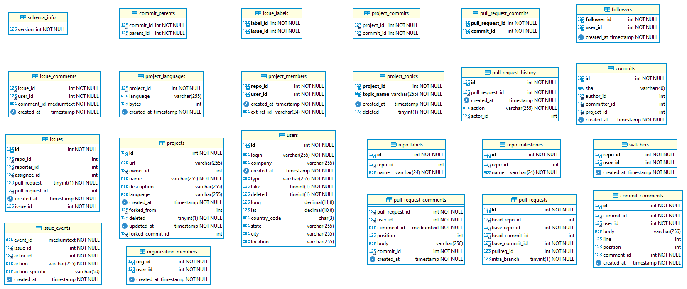

## Projeto de Mineração de Repositórios

Este projeto é apenas um script para coletar dados do github.
Alguns problemas podem ser encontrados, e fica a responsabilidade do utilizador modificar e resolver a maioria deles. 
Mas, caso tenha ideias interessantes para agregar neste projeto, fique a vontade para enviar seu pull request com uma descrição das modificações e explicando suas intenções.

## Guia básico para utilização

É necessário obter uma [chave de api no github](https://docs.github.com/pt/github/authenticating-to-github/keeping-your-account-and-data-secure/creating-a-personal-access-token) e então modificar o .env com sua chave.

O arquivo .env.example deve ser utilizado como base para criar seu arquivo .env.
Faça uma cópia do .env.example e renomeie para .env alterando os campo necessários.
Alguns valores já estão configurados com o valor padrão, mas é possível alterar para o que você quiser.

## Iniciando

Depois que você configurou seu .env, para executar digite:

```bash
yarn # Install the dependencies

# Execute the miner into one project
# yarn mine project [projectOwner] [projectName]
yarn mine project "JabRef" "jabref"

# Execute the miner into each project into the file sequentially
# yarn mine file [filename] # must be like the file named `projects`
yarn mine file ./projects

# Each project generates a CSV into the folder ./outputs
# To join all csvs into a single one, use:
# yarn mine join-outputs [output-filepath]
yarn mine join-outputs ./tmp/all-projects.csvs

# Calculate the time between 2 dates
# Useful to measure the time execution between intervals
# yarn mine diff-time [date1] [date2] # dates are in ISO format
yarn mine diff-time "2021-07-19T16:19:59.473Z" "2021-07-19T17:10:06.672Z"

# Clear all database data
# yarn mine clear
yarn mine clear
```

## Etapas da coleta

Existem 9 etapas de coleta, dentre elas:

|   | Etapa | Estimativa de<br>requisições | Tempo de execução<br>(jabref) | Observações |
|:-:|:-----------------------------:|:----:|:--------:|:---:|
| 1 | Dados do repositório          | 1    |     -    |  |
| 2 | Pull requests fechados        | X    | 00:05:51 | X é aproximadamente PR / 30 |
| 3 | Dados dos pull requests       | PR   | 01:09:23 |  |
| 4 | Comentários dos pull requests | -    | 00:57:52 | - Serão ignorados futuramente<br>- Estes dados já existem dentro<br> dos comentários das issues |
| 5 | Issues                        | ISU  | 01:26:28 |  |
| 6 | Comentários das issues        | ISUC | 01:26:28 | - ISUC é aproximadamente ISU<br>- 5 min. IDLE |
| 7 | Solicitante segue o gerente   | Y    | 00:05:49 | Y é uma porcentagem de PR |
| 8 | Arquivos dos pull requests    | PRF  | 01:36:45 | - PRF é ligeiramente <br> maior ou igual a PR.<br>- 6 min. IDLE |
| 9 | Dados do solicitante          | Y    | 00:04:09 |  |

Matemáticamente temos:

* 1 + X + PR + ISU + ISUC + (2 * Y) + PRF
* Onde:
  * X     ~=  PR / 30
  * ISUC  ~=  ISU
  * Y      =  PR * L, e L >= 1
  * PRF   >=  PR
* Aproximando ISU, ISUC, PRF para um valor próximo de PR, e aproximando X para um valor próximo de Y temos:
  * 1 + Y + PR + PR + PR + (2 * Y) + PR
  * 1 + (4 * PR) + (3 * Y) número de requisições.

Tempo de execução para o repositório do jabref:
- Total:            05:32:27
- Tempo redundante: 00:57:52
- Tempo final:      04:34:35

Observando as medidas de tempo para a execução sequência das requisições, percebe-se que é possível fazer 1000 requisições a cada 15 min.
Isto equivale a 66 requisições por min.
Utilizando a formula acima, após coletar a lista de pull requests, podemos calcular PR, e então estimar o tempo de execução com:

* 1 + (4 * PR) + (3 * Y), ignorando 1 requisição contante
* (4 * N) + (3 * Y), utilizando Y = 0.1 * N
* (4 * N) + (3 * 0.1 * N)
* (4 * N) + (0.3 * N)
* (4.3 * N) requisições totais.

O tempo aproximado em minutos seria **4.3 * N / 66**.

Utilizando o jabref como exemplo, ele possui 4619 pull requests. Aplicando este número na formula temos:

* 4.3 * 4619 / 66 ~= 301 minutos ~= 5 horas.

https://api.github.com/repos/{}/contributors

## Geração do CSV

* campos boleanos são representados com 0 e 1.
* campos sem valor devem ficar vazios
* `age` é representado em meses

| Pos. | Nome                     | Tipo          | Categoria    |
|:----:|:------------------------:|:-------------:|:------------:|
|   1  | project_name             | string        | projeto      |
|   2  | language                 | string        | projeto      |
|   3  | age                      | int           | projeto      |
|   4  | stars                    | int           | projeto      |
|   5  | contributors_count       | int           | projeto      |
|   6  | submitter_login          | string        | pull request |
|   7  | merger_login             | string        | pull request |
|   8  | pull_request_id          | int           | pull request |
|   9  | files_changed_count      | int           | pull request |
|  10  | changed_counts           | int           | pull request |
|  12  | is_merged                | bool          | pull request |
|  13  | pr_comments_count        | int           | pull request |
|  13  | pr_review_comments_count | int           | pull request |
|  14  | has_test                 | bool          | pull request |
|  15  | is_following             | bool          | pull request |
|  16  | followers_count          | int           | usuário      |
|  17  | is_collaborator          | bool          | usuário      |
|  18  | prior_iterations_count   | bool          | usuário      |

## Análise do banco de dados do Git Torrent

* O banco de dados de repositórios do Git Torrent.



* Coletar o número de total de projetos:
* Filtrar por
  * excluir forks
  * excluir repositórios sem pull requests anterior a data da coleta
  * excluir repositório com menos de 3 contribuidores

```sql
SELECT COUNT(1) FROM projects;
-- Resultado: 189.467.747
-- 1 row in set (0.00 sec)

SELECT COUNT(1) FROM pull_requests;
-- Resultado: 109.545.627
-- 1 row in set (0.01 sec)

SELECT COUNT(1) FROM pull_request_history
-- Resultado: 252.123.337
-- 1 row in set (0.00 sec)

SELECT COUNT(1) FROM projects WHERE forked_from IS NOT NULL;
-- Resultado: 68.554.938
-- 1 row in set (31.53 sec)

SELECT COUNT(p.id)
FROM projects p
WHERE p.forked_from IS NULL AND
  p.id IN (
    SELECT DISTINCT pr.base_repo_id
    FROM pull_requests pr
    WHERE pr.id IN (
      SELECT DISTINCT prh1.pull_request_id
      FROM pull_request_history prh1
      WHERE prh1.`action` IN ('merged', 'closed') AND
        prh1.actor_id IN (
          SELECT DISTINCT prh.actor_id
          FROM pull_request_history prh
          GROUP BY prh.actor_id
          HAVING COUNT(prh.actor_Id) >= 3
        )
    )
  )
-- Resultado: 8.903.934
-- 1 row in set (45 min 6.64 sec)

SELECT COUNT(p.id)
FROM projects p
INNER JOIN pull_requests pr ON p.id = pr.base_repo_id
WHERE p.forked_from IS NULL AND
  pr.id IN (
      SELECT DISTINCT prh1.pull_request_id
      FROM pull_request_history prh1
      WHERE prh1.`action` IN ('merged', 'closed') AND
        prh1.actor_id IN (
          SELECT DISTINCT prh.actor_id
          FROM pull_request_history prh
          GROUP BY prh.actor_id
          HAVING COUNT(prh.actor_Id) >= 3
        )
    )
  )
```

## Dados coletadas

- [x] Projeto
  - [x] Nome do projeto
  - [x] Idade do projeto
  - [x] Linguagem
  - [x] Número de estrelas
  - [x] Número de colaboradores
    - [x] Quantidade de pessoas que tiveram um pull request aceito
    - [x] Verificar se a contagem foi feita corretamente
- [x] Informação de um **pull request** fechado
  - [x] Login de quem solicitou
  - [x] Login de quem aceitou (Gerente)
  - [x] Número de linhas modificadas, removidas e adicionadas
  - [x] Quantidade de arquivos alterados, removidos e adicionados
  - [x] Existem testes (caminhos dos arquivos contém "test")
  - [x] O pull request foi aceito
  - [x] Solicitante é seguidor do gerente que aceitou
  - [x] Quantidade de comentários
- [x] Informações de usuários
  - [x] É um coladorador?
    - [x] Tem a permissão de fazer commits no projeto.
    - [x] Se existir um PR aceito, ele é um colaborador?
      - [x] 'author_association' = "CONTRIBUTOR"
      - Não
    - [x] 'author_association' ("NONE" | **"MEMBER"** | **"COLLABORATOR"** | "CONTRIBUTOR")
      - [x] Verificar o significado deste atributo.
  - [x] Número de seguidores
  - [x] Contagem das interações do usuário com o repositório antes do pull request

## Operações sobre o mongo com Docker

```bash
# fazendo um backup
docker exec -it mongo bash
mongodump --uri="mongodb://localhost:27017/repo-mine" --out=./backup
exit
# ou
docker exec -it mongo mongodump --uri="mongodb://localhost:27017/repo-mine" --out=./backup

# Copiando o backup para o hospedeiro
docker cp mongo:/backup ./backup/

# Copiando o backup para o container
docker cp ./backup/repo-mine/ mongo:/backup/repo-mine

# fazendo a restauração do backup
docker exec -it mongo bash
mongorestore --uri="mongodb://localhost:27017/repo-mine" --db=repo-mine /backup/repo-mine/
exit
# ou
docker exec -it mongo mongorestore --uri="mongodb://localhost:27017/repo-mine" --db=repo-mine /backup/repo-mine/
```

## TODO

* 100 projetos com mais estrelas de cada linguagem
  - Javascript
  - Python
  - Java
  - Typescript
  - C#
  - PHP
  - C++
  - C
  - Objective-C
  - Ruby

```sql
SELECT COUNT(DISTINCT(language)) FROM projects;
-- Resultado: 449
-- 1 row in set (13 min 27.37 sec)

SELECT COUNT(1) FROM projects GROUP BY language;
-- ERROR 1114 (HY000): The table '/tmp/#sql704c2_144_4' is full
-- A cláusula "GROUP BY" causa estouro de memória.

```

* Separação das linguagens por grupos:

Daniel e Luiz: PHP, Javascript
Golom e Jonas: Objective-C, C
Henrique e Alan: C++, Python, Ruby
Luis Otávio e Rafael: Java, Typescript, C#

* Tarefa:

Entrar nos projetos e conferir se tem 3 contribuidores e 3 pull requests fechados. 
Verificar se o projeto não é um tutorial.
Anotar a quantidade de pull requests de cada projeto.

## Referencias

* [Informações sobre atualização do uso da chave de api do github](https://developer.github.com/changes/2020-02-10-deprecating-auth-through-query-param/)
